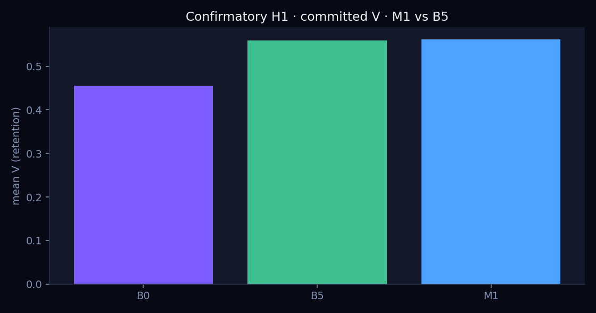
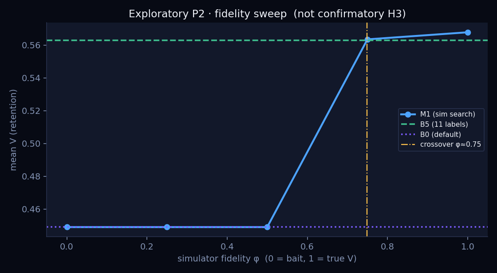

# Outer loop

**Can a fitted simulator reduce the live tests you need to pick ranking weights — and can you tell when it is lying?**

X For You does not retrain the ranker when the product changes. It changes a weight on P(like), P(reply), P(report):

```
score(u, i) = w · p̂(u, i)
```

This repo is a **standalone synthetic benchmark** of that *outer* loop. The inner ranker is frozen. Search methods compete under a fixed budget of user-days. Ground-truth 21-day retention `V` is known, so regret is exact.

It is **not** live For You, not X production data, and not a claim that RL should replace A/B tests.

The structure is borrowed from X’s open-sourced For You stack: [`xai-org/x-algorithm`](https://github.com/xai-org/x-algorithm) — Home Mixer weights in [`param.rs`](https://github.com/xai-org/x-algorithm/blob/main/home-mixer/params/param.rs), and the human search loop in [`BIDIRECTIONAL_BOOST_CHANGE.md`](https://github.com/xai-org/x-algorithm/blob/main/docs/BIDIRECTIONAL_BOOST_CHANGE.md) (tried 5 / 10 / 15 / 20, shipped 20, walked back to 15). This repo does not contain that code.

Write-up: [DEV.to](https://dev.to/rams901/you-dont-retrain-for-you-when-the-product-changes-you-change-a-weight-i-simulated-that-loop-4ln8) · [LinkedIn](https://lnkd.in/p/eeJaU5Yw) · [pre-registration](PREREGISTRATION.md) · [confirmatory H1](docs/17-h1.md)

---

## What we found

| Claim | Result |
|---|---|
| Maximise the **2-day proxy** (likes + dwells) | Beats default this week, **loses retention**. Walk-back 5/5 in the pilot. |
| Spend the same budget on **delayed V** (B5: 11 labels) | About **+0.10** vs shipping default. The expensive metric is the product. |
| **Fit a GP** on those labels and extrapolate (M1) vs just picking the best measured row | Confirmatory **N=50**, seeds 30–79. Mean V **0.562 vs 0.560**. Wilcoxon p=0.013, median ΔR=−0.025, CI **touches 0**. Powered for an MDE of 0.10. |
| Sim **blind to bait** | Live confirm rejects it; you ship default. Crossover vs B5 at φ≈0.75. |
| Per-topic weights (C4) | ~0 headroom. Gate failed. |



*B0 = synthetic default. B5 = eleven delayed-V labels. M1 = GP on the same labels. The gap that matters is still B5 vs B0.*



*Exploratory bait-blindness dial. φ=1 is true V. φ=0 maximises bait share. Half-right is the same as no sim.*

Locked numbers live in [`analysis/confirmatory_h1.json`](analysis/confirmatory_h1.json) and [`analysis/stage2_lock.json`](analysis/stage2_lock.json). Protocol: [`PREREGISTRATION.md`](PREREGISTRATION.md).

---

## Watch one user

Same person, 21 days, **Tab** between default and an engagement-tilted trap. Rose = bait. Gray cell = did not open the app.

```bash
pip install -e '.[pixel]'
OMP_NUM_THREADS=1 PYTHONPATH=src python -m rl_opt.pixel_world
```

Space plays days. Click a cell for that user's feed. Notes: [`docs/19-pixel-world.md`](docs/19-pixel-world.md).

---

## Install

Python 3.10+. NumPy is the only required dependency. Search (GP, EI, CMA-style ES, Wilcoxon) is written on NumPy — no SciPy / sklearn / PyTorch.

```bash
git clone https://github.com/Rams901/outer-loop.git
cd outer-loop
python -m venv .venv && source .venv/bin/activate
pip install -e '.[dev,viz,pixel]'
pytest
```

Set `OMP_NUM_THREADS=1` on any long job. The confirmatory run is hours, not minutes.

---

## Reproduce

| Command | What |
|---|---|
| `pytest` | Unit tests (CI) |
| `python -m rl_opt.prove_c1` | Horizon / score-term checks |
| `python -m rl_opt.run_pilot` | B0–B4 vs oracle, 5 seeds |
| `python -m rl_opt.run_m1_dev` | One allowed M1 retune (seeds 20–24) |
| `python -m rl_opt.run_m1` | Exploratory M1 vs B5 (not confirmatory) |
| `python -m rl_opt.run_fidelity` | Exploratory bait-blindness sweep |
| `python -m rl_opt.run_q8` | Four kinds of “the sim is wrong” |
| `python -m rl_opt.prove_c4` | Per-segment vs global |
| `python -m rl_opt.stage2` | Rewrite the lock file from the pilot sd |
| `python -m rl_opt.run_confirmatory` | **H1**, N=50, seeds 30–79 |

Frozen confirmatory method: `m1_gp_lcb_one`. Exploratory seeds 10–14 are never reused.

---

## How the benchmark is built

```
outer loop (this repo)          inner loop (frozen)
----------------------          -------------------
propose w                       score = w · p̂
spend user-days                 top-12 feed
observe proxy and/or V          actions, sat, return
commit or walk back
```

Methods share one budget (`Harness`). B0 ships the synthetic default. B1–B4 maximise the 2-day proxy. B5 spends the budget on delayed V and ships the best *measured* row. M1 fits a small RBF GP on those labels and searches the surrogate, then confirms.

Default `w` is **not** August `param.rs`. Like/dwell were moved so the incumbent is beatable (`V*−V₀ ≈ 0.10`). Hide/report magnitudes still echo production so inverse-propensity scaling is in the problem.

---

## Docs

| | |
|---|---|
| [`PREREGISTRATION.md`](PREREGISTRATION.md) | Hypotheses, metrics, seeds, what is confirmatory |
| [`docs/17-h1.md`](docs/17-h1.md) | Confirmatory result |
| [`docs/14-stage2.md`](docs/14-stage2.md) | N=50 lock |
| [`docs/12-fidelity.md`](docs/12-fidelity.md) · [`docs/16-q8.md`](docs/16-q8.md) | When the sim is lying |
| [`docs/15-c4.md`](docs/15-c4.md) | Contextual gate (failed) |
| [`docs/18-business-value.md`](docs/18-business-value.md) | New feed vs For You (protocol, not a post draft) |
| [`docs/19-pixel-world.md`](docs/19-pixel-world.md) | Viewer |

Design notes `01`–`13` are the lab trail (objectives, world, recalibration after a flat optimum). Don't mix numbers from `docs/06`–`08` with `09`+.

---

## Non-claims

- We did not run RL on live For You.
- We did not ship `param.rs`.
- A p=0.013 confirmatory edge that the CI allows to be zero is not “simulation replaces A/B.”
- M2 / PPO is deferred: the effect is too small to justify that stack.

---

## License

MIT. Independent of X / xAI. Three structural facts are borrowed from [x-algorithm](https://github.com/xai-org/x-algorithm) (linear score over action probabilities, inverse-propensity weight scale, `w` and `k w` rank the same). Everything else — world, labels, search, stats — is ours.
