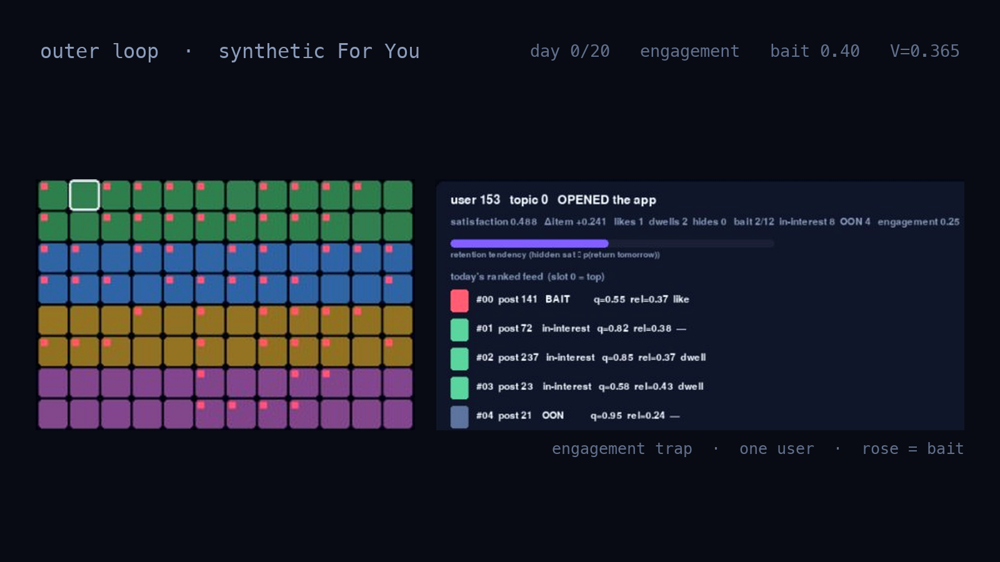
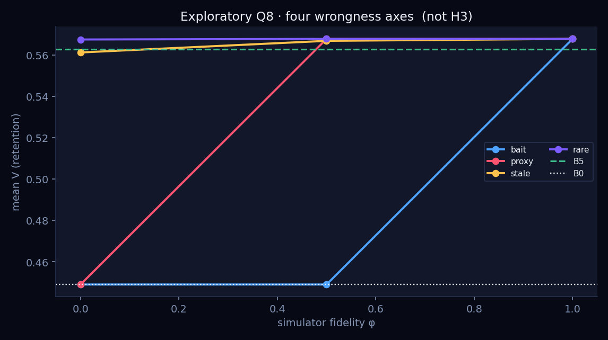

# 21 — DEV.to article (paste into the editor)

DEV.to: New post → Markdown. Upload figures from `docs/assets/` and
`analysis/figures/` and replace the local image paths. Tags suggestion:
`recommender`, `python`, `simulation`, `abtesting`, `machinelearning`.

Cover (1000×420): [`assets/devto-cover.png`](assets/devto-cover.png).
In-article still (16:9): [`assets/devto-hero.png`](assets/devto-hero.png).
Retina source if you want: [`assets/devto-cover@2x.png`](assets/devto-cover@2x.png).

LinkedIn (short): [`20-linkedin-post.md`](20-linkedin-post.md). This article
is the same story, slightly expanded.

---

<!-- paste from here -->

# You don't retrain For You when the product changes. You change a weight. I simulated that loop.

X's Home Mixer does not pick posts by training a new model every time someone
wants more replies and fewer empty likes. It multiplies *predicted*
probabilities by a vector in `param.rs`:

$$
\mathrm{score}(u, i) = w \cdot \hat{p}(u, i)
$$

Favorite \(0.5\), reply \(5\), report \(-234\). Change \(w\), the ranking
changes, no retraining. The open-source trail even shows how humans search
that vector: a mutual-follow reply boost was tried at 5, 10, 15 and 20,
rolled out at 20, then walked back to 15. Propose, randomise, observe,
correct — with people inside the policy.

I wanted to know two things, in a world where the ground truth is *ours*:

1. Can offline simulation **reduce** the live tests you need to pick \(w\)?
2. Can you tell **when the sim is lying**?

This is a **synthetic** benchmark inspired by that structure. It is not live
For You, and the default \(w\) on screen is not August `param.rs` (we moved
likes/dwells on purpose so the incumbent was beatable). Inner ranker frozen.
Outer loop = config tuner. Objective = 21-day retention \(V\), with hard
safety floors.

The video that goes with this post is one user, day 0 through 20, **Tab**
between default and an engagement-tilted trap. Rose tiles are bait. Green is
in-interest. Slate is out-of-network. Gray cells on the cohort grid did not
open the app that day.

*Still from the pygame viewer. Left: 96 users, colour = topic, rose pip =
bait-heavy feed. Right: that day's ranked top of feed for the selected cell.
This frame is the trap on day 0 — busy, bait in slot 0 — before the gray
cells show up.*

## Two timescales (don't mix them)

**Inner loop** (one user, one day): sample candidates → score with \(w \cdot
\hat{p}\) → top-12 feed → true actions, with position decay → hidden
satisfaction updates → probability they return tomorrow.

**Outer loop** (the product process): propose a new \(w\), spend user-days,
see a fast proxy, maybe see \(V\) later, ship or walk back.

The pygame viewer is the inner loop, slowed down. The numbers below are the
outer loop, pre-registered.

## What "winning" even means

We score the config you **commit**, not the best you ever saw:

$$
R = \frac{V(w^\*) - V(\hat{w})}{V(w^\*) - V(w_0)}
$$

\(R = 0\) found the optimum, \(R = 1\) no better than shipping default and
spending nothing. Unsafe commits get a fixed penalty. Every method gets the
same user-day budget.

The 2-day **proxy** is likes + dwells per impression. It is observable. It
is not \(V\).

## Theories we actually ran

**1. Search the proxy** (grid, random, GP, ES).  
Every method beat default on the 2-day number and **lost on retention**.
Walk-back 5/5 in the pilot. Bait roughly doubled. This is the
bidirectional-boost failure mode as a rule: if you maximise what you can
see tomorrow, you will ship a reversal.

**2. Spend the same budget on delayed \(V\)** (eleven full-horizon labels,
ship the best *measured* row).  
About **+0.10** retention vs doing nothing. The expensive metric *is* the
product. Waiting beats clever search on the wrong number.

**3. Fit a simulator on those labels and extrapolate** vs just picking the
best measured config.  
Confirmatory, \(N = 50\), new seeds, one retune frozen in advance. Wilcoxon
on paired regret: \(p = 0.013\), median \(\Delta R = -0.025\), bootstrap CI
**touches 0**. Mean \(V\): **0.562 vs 0.560**. We powered for an MDE of 0.10
in \(R\). We saw a quarter of that. A model of the labels does not replace
buying more of them.

*Figure: confirmatory H1. B0 = synthetic default. B5 = eleven delayed-V
labels. M1 = GP on the same labels. The gap that matters is still B5 vs B0,
not M1 vs B5.*

**4. How wrong can the sim be?**  
Hand-specified fidelity: mix true \(V\) with bait share (the missing-feature
failure — the sim cannot see that emptiness hurts return). Below about
"mostly the objective," a live confirm rejects the sim's pick and you ship
default. Other wrongness is milder: stale tastes and hide/report
miscalibration barely moved the ranking.

*Figure: exploratory bait-blindness dial. \(\varphi = 1\) is true \(V\).
\(\varphi = 0\) maximises bait share. Horizontal line is eleven honest
labels. Half-right is the same as no sim.*

*Figure: four kinds of "the simulator is wrong." Bait-blindness is the
harsh axis. Don't collapse them into one \(\varphi\) and panic equally.*

**5. Per-segment weights.**  
Best config per topic vs one global \(w\): ~0 of headroom. Don't staff a
contextual tuner until the global config is a real compromise.

## New website / new feed

You have no delayed \(V\) yet. Starting with a simulator is starting with
fanfiction.

1. Ship a conservative default (do not overweight cheap engagement).
2. A **short delayed-retention screen**: default vs quality tilt vs
   engagement tilt. Hold for the real horizon. Ship the best *measured*
   \(V\).
3. Only then use a sim to **kill** candidates. Confirm 1–2 live. If sim and
   confirm disagree, ship default or the measured winner.

Never: sim first, tests later.

## X For You

This does **not** say change `FavoriteWeight` to 1.8. Production is already
closer to a quality-shaped vector than our beatable toy default. We left
`param.rs` on purpose so search had something to do.

What *does* transfer:

- Spend traffic on **delayed retention**, not on a surrogate of the same
  labels.
- Use offline replay to **stop 2-day-only wins** before ramp.
- If the offline score **cannot see emptiness** (bait, empty dwell), it is
  not allowed to ship. That is how you know it's wrong. Stale user mix or
  a miscalibrated report head is a milder failure here.

A simulator cannot replace Home Mixer experiments. It can stop the ones that
only win on two-day engagement — and you can watch that happen to one user,
one day at a time.

*Standalone synthetic benchmark, pre-registered. Not X production data.
Code: inner ranker `score = w · p̂`; pygame viewer records a real 21-day
rollout, it does not re-rank in the game loop.*

<!-- end paste -->
